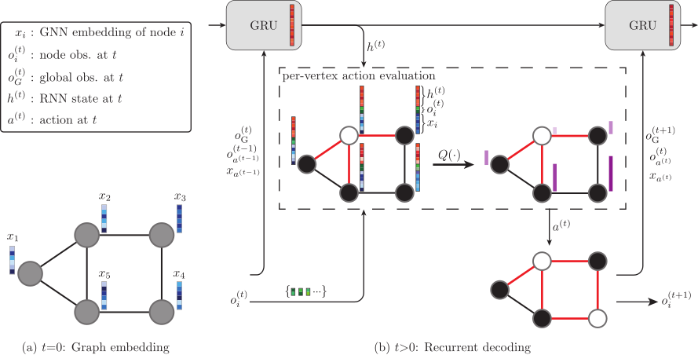

# ecord

[](tbc)
[](./LICENSE)

---

This repository contains the codebase developed for the paper [Learning to Solve Combinatorial Graph Partitioning Problems via Efficient Exploration](tbc).

---

<p align="center">
<figure>

<figcaption align = "center"><b>The architecture of ECORD. (a) A GNN generates embeddings for each vertex at t = 0. (b) At each timestep, a recurrent unit takes as input the GNN embedding, the node-level observation from the previous time step, and the global observation from the current time step, and updates its hidden state. To select an action (node to flip), the hidden state is concatenated with the node-level observation at the current time step and passed to a Q-network.</b></figcaption>
</figure>
</p>
       
## Overview

#### Datasets


We train agents on two different types of graph called Erdos-Renyi (ER) and Barabasi-Albert (BA).  Whilst training uses randomly generated problem instances, we provide additional datasets in the [graphs](graphs) folder to testing and validation.

- [graphs/ecodqn](graphs/ecodqn): Contains 50/100 ER and BA graphs for testing/validation with  20, 40, 60, 100, 200 and 500 vertices.  The validation graphs also come with "optimal" cut-values in the ```.../opts/``` folder.
- [graphs/generated](graphs/generated): Contains larger problem instances from ER500 to ER10000.
- [graphs/gset](graphs/gset):  Contains the cut values for the GSet graphs.  A [script](graphs/download_gset.sh) to download the problem instances used to the paper is also provided.

#### Installation

A [Dockerfile](Dockerfile) is provided to run the code.  Currently the installation uses PyTorch v1.7.1 and cuda v11.0 for GPU code.

*Depending on the available hardware, the Dockerfile may need to be modified.  Specifically the PyTorch base image (line 1) and the url from which ```torch-geometric``` and related packages are fetched (line 7) may need modifying.  For example, to install for cpu-only running, line 7 of the [Dockerfile](Dockerfile) can be replaced with the below.*
```dockerfile
RUN pip install -r /tmp/requirements.txt -f https://data.pyg.org/whl/torch-1.7.1+cpu.html
```

To build the Docker image, start a container, and enter it, run the following from the root directory of the repository.  Finally we compile the necessary Cython code (this is only required when first starting the container). 
```commandline
>>> docker build . -t ecord -f Dockerfile
>>> docker run -itd --rm --name ecord_container -v /local/path/to/ecord/:/home/app/ecord ecord
>>> docker exec -it ecord_container bash
>>> python setup_cy.py build_ext --inplace --force
```

#### Training

A [training script](experiments/train.py) is provided (which by default trains ECORD on ER40 graphs, but can be simply modified to train/test on different graphs as desired).

```commandline
>>> python experiments/train.py --save_loc data/training/ --name run1
```

*To train the ECO-DQN baseline, an equivilent script ```experiments/train_ecodqn.py``` is provided and can be run in the same way.*

#### Validation

The [validation](experiments/validate.py) script can be modifed to rollout checkpoints from training with various customisation.  Full details of the options can be found in the script, but an example of validating the agent trained above is below.

```commandline
>>> python experiments/validate.py \
       --save_loc data/training/ \
       --name run1 \
       --checkpoint_name solver_best_mean_ER40 \
       --graph_loc graphs/ecodqn/validation/ER_40spin_p15_100graphs \
       --num_steps 80 \
       --num_load 100 \
       --num_tradj 50 \
       --graph_batch_size 50 \
       --tradj_batch_size 50 \
       --tau 5e-4 \
       --save_summary \
       --log_stats
```

*To validate ECO-DQN, simply run with the ```--ecodqn``` option.*

## Reference

If you find this project or the associated paper useful, it can be cited as below.

    @article{barrett2022ecord,
      title={Learning to Solve Combinatorial Graph Partitioning Problems via Efficient Exploration},
      author={Barrett, Thomas D and ...},
      journal={arXiv preprint arXiv:XXXX.XXXXX},
      year={2022}
    }
